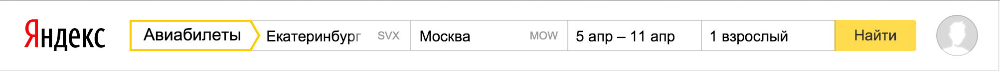
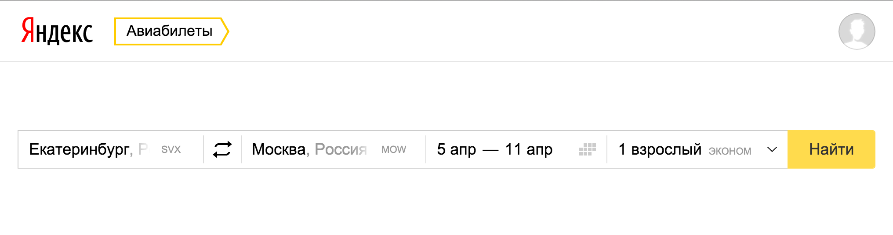
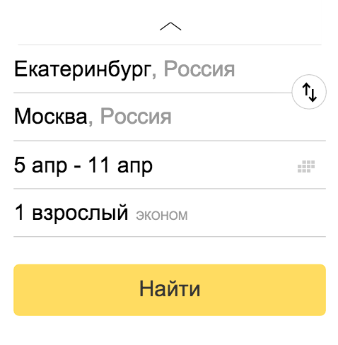

---

layout: default

---

# Яндекс

## **{{ site.presentation.title }}** {#cover}

    
{{ site.presentation.service }}

	
{{ site.author.name }},   Группа интерфейсов сервисов расписаний

## BE(M|ViS)
{:.shout}

## BE &mdash; хорошо
{:.shout}

## M в общем тоже неплохо
{:.shout}

## Модификаторы
* ... + Гибкость
* ... — Непредсказуемость

## Непредсказуемость
~~~
.button_theme_normal {
    border: 1px solid rgba(0,0,0,.2);
}
.button_pin_left {
    border-left: 0;
}
~~~

## Модификаторы
* ... + Гибкость
* ... — Непредсказуемость

## ViS
{:.shout}

## View
~~~
<button class="button button_size_large
    button_theme_action" />

<button class="button_large-action" />
~~~

## State
~~~
<button class="button button_size_large
    button_theme_action button_pressed_yes" />

<button class="button_large-action _pressed" />
~~~

## View и State
* ...+ Надёжность
* ...— Трудно вносить изменения

## Общий минус
{:.shout}

## Форма

## Форма

## Форма
* BEM &mdash; поменять модификаторы у 6 блоков через js
* ...BEViS &mdash; view нельзя поменять в рантайме. Обходим серией убогих фокусов.

## Форма

## Отображение блоков может зависеть от контекста
{:.shout}

## Отображение может зависеть от контекста
* состояние родительского блока
* размер экрана
* порядок в дереве

## Чего хотелось
* ...Отделить состояния от оформления (BEViS)
* ...Иметь контроль над порядком применения стилей (BEViS)
* ...Легко комбинировать и модифицировать параметры отображения (BEM)
* ...Легко менять отображения в зависимости от контекста (-)

## Решение
~~~
.Form .Button {
    size: medium;
    theme: action;
}
.Form_expanded .Button {
    size: large;
}
~~~

## Модификаторы-классы  &darr;  модификаторы-свойства
{:.shout}

## Реализация (миксины)
~~~
Button_size($size) {
    if ($size == normal) {
        font-size: 13px;
    }
    if ($size == large) {
        font-size: 15px;
    }
}
~~~

## Реализация (миксины)
~~~
.Form .Button {
    Button_size(normal);
    Button_theme(action);
}
.Form_expanded .Button {
    Button_size(large);
}
~~~

## На самом деле даже
~~~
.Form .Button {
    Button_size: normal;
    Button_theme: action;
}
.Form_expanded .Button {
    Button_size: large;
}
~~~

## Есть нюансы
* ...дочерние селекторы - плохо

## Дочерние селекторы - плохо
~~~
<main class="Content">
    <form class="Form">
        <button class="Button" />
    </form>
</main>
~~~

## Дочерние селекторы - плохо
~~~
.Form .Button {
    Button_size: large;
}
.Content .Button {
    Button_size: normal;
}
~~~

## Миксы!
~~~
<main class="Page">
    <form class="Form">
        <button class="Button Form__submit" />
    </form>
</main>
~~~

## Миксы!
~~~
.Form__submit.Button {
    Button_size: large;
}

.Content__button.Button {
    Button_size: normal;
}
~~~

## Есть нюансы
* <strike>дочерние селекторы - плохо</strike>
* ...пересечение разных модификаторов по свойствам

## Наложение
~~~
Button_size($size) {
    font: 13px/18px Arial;
}
Button_theme($theme) {
    font-family: Verdana;
}
~~~

## Разделение ответственности
~~~
Button_size($size) {
    // font-size, margin, padding ...
}
Button_theme($theme) {
    // font-family, background, color ...
}
~~~

## Нельзя разделить
~~~
Button_size($size) {
    border-radius: ...
}
Button_shape($shape) {
    border-radius: ...
}
~~~

## Можно объединить
~~~
Button_geometry($shape, $size) {
    if ($size == normal && $shape == round) {
        border-radius: 10px;
    }
    if ($size == large && $shape == round) {
        border-radius: 20px;
    }
}
~~~

## Или добавить где-то дополнительный параметр
~~~
Button_size($size) {
    // как есть, без border-radius
}
Button_shape($shape, $size = normal) {
    // выставляем нужный border-radius
}
~~~

## Есть нюансы
* <strike>дочерние селекторы - плохо</strike>
* <strike>пересечение разных модификаторов по свойствам</strike>
* ...разные значения одного модификатора задают разные свойства

## Разные значения
~~~
Button_theme($theme) {
    if ($theme == action) {
        background: #fc0;
    }
    if ($theme == promo) {
        box-shadow: 0 0 0 10px #fc0;
    }
}
~~~

## Перекрытие
~~~
Button_theme($theme) {
    if ($theme == action) {
        background: #fc0;
        box-shadow: none;
    }
    if ($theme == promo) {
        background: transparent;
        box-shadow: 0 0 0 10px #fc0;
    }
}
~~~

## Есть нюансы
* <strike>дочерние селекторы - плохо</strike>
* <strike>пересечение разных модификаторов по свойствам</strike>
* <strike>разные значения одного модификатора задают разные свойства</strike>
* ...иногда нужно задать дополнительные свойства

## Можно прямо так
~~~
.Form__submit.Button {
    Button_theme: action;
    Button_size: normal;

    width: 100px;
}
~~~

## Но лучше так
~~~
.Form__submit.Button {
    Button_theme: action;
    Button_size: normal;

    Button_width: medium;
}
~~~

## Есть нюансы
* <strike>дочерние селекторы - плохо</strike>
* <strike>пересечение разных модификаторов по свойствам</strike>
* <strike>разные значения одного модификатора задают разные свойства</strike>
* </strike>иногда нужно задать дополнительные свойства</strike>

## Что хотели
* Отделить состояния от оформления
    * ...Состояния остались классами, оформление стало миксинами
* Иметь контроль над порядком применения стилей
    * ...Все стили блока применяются в одном месте
* Легко комбинировать и модифицировать параметры отображения
    * ...Можно вызвать нужный набор миксинов, при необходимости дополнив
* Легко менять отображения в зависимости от контекста (-)
    * ...Да

## Бонусы
* ...осмысленный, лёгкий и читаемый html
* ...неиспользуемые модификаторы не попадут в сборку

{:.shout}
## Всё
